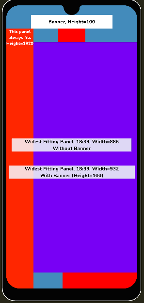

# UI Scaling Toolkit

[](https://github.com/Delt06/ui-scaling-toolkit/releases)
[](https://opensource.org/licenses/MIT)



A collection of components to ensure proper UI scaling for mobile devices.

> Developed and tested with Unity 2021.3.3f1 LTS
> 
> Designed to work with Portrait mode games. 

## Installation
### Option 1
- Open Package Manager through Window/Package Manager
- Click "+" and choose "Add package from git URL..."
- Insert the URL: https://github.com/Delt06/ui-scaling-toolkit.git?path=Packages/com.deltation.ui-scaling-toolkit

### Option 2
Add the following line to `Packages/manifest.json`:
```
"com.deltation.ui-scaling-toolkit": "https://github.com/Delt06/ui-scaling-toolkit.git?path=Packages/com.deltation.ui-scaling-toolkit",
```

## Dependencies
- Unity UI (uGUI)
- Device Simulator (bundled with Unity)

## Components
- Safe Area Canvas Scaler - ensures safe area always has intended height
- Safe Area Settings - extra configuration 
  - Whether to ignore bottom unsafe area or not 
  - Extra padding (e.g. to handle banners)
- Safe Area Rect - adjusts anchors (full screen) to exclude unsafe area

> Tip: full screen backgrounds and overlays should not be inside a Safe Area Rect to prevent creating holes in unsafe area.

## Device
According to a [StackOverflow thread](https://stackoverflow.com/questions/7199492/what-are-the-aspect-ratios-for-all-android-phone-and-tablet-devices), the lowest width to height ratio is 9:19.5.

The package adds a custom device called "Widest Android" to Device Simulator to cover that case.
